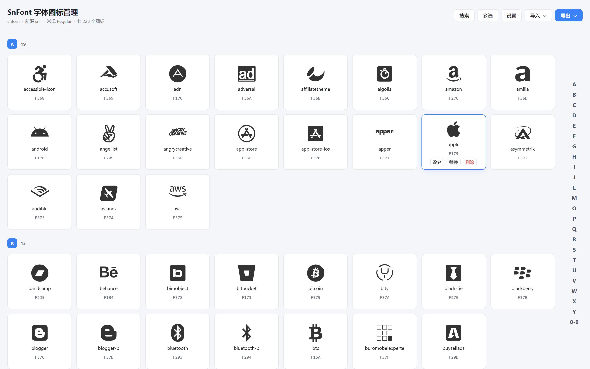
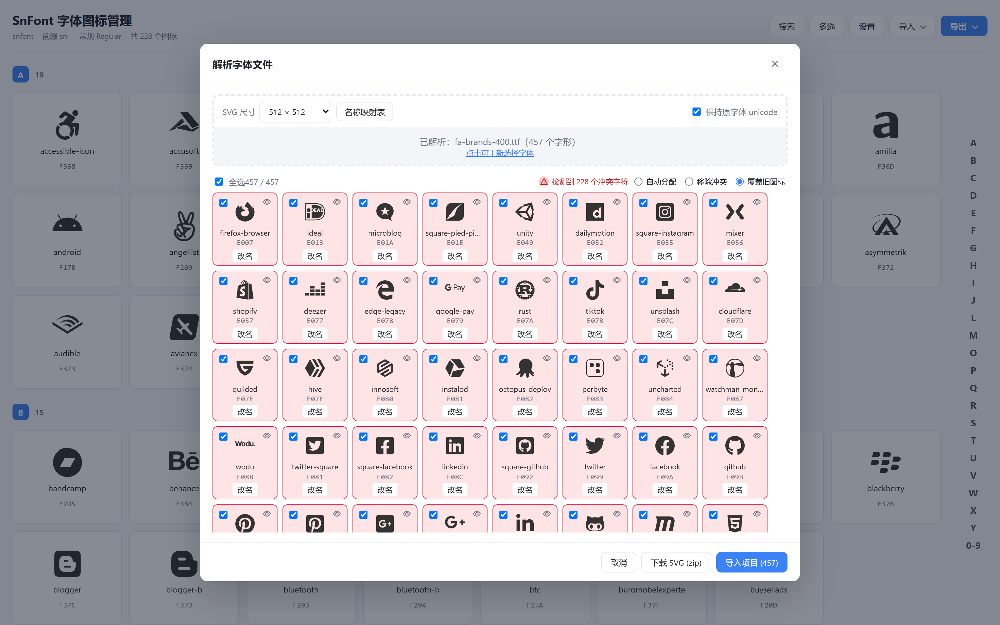
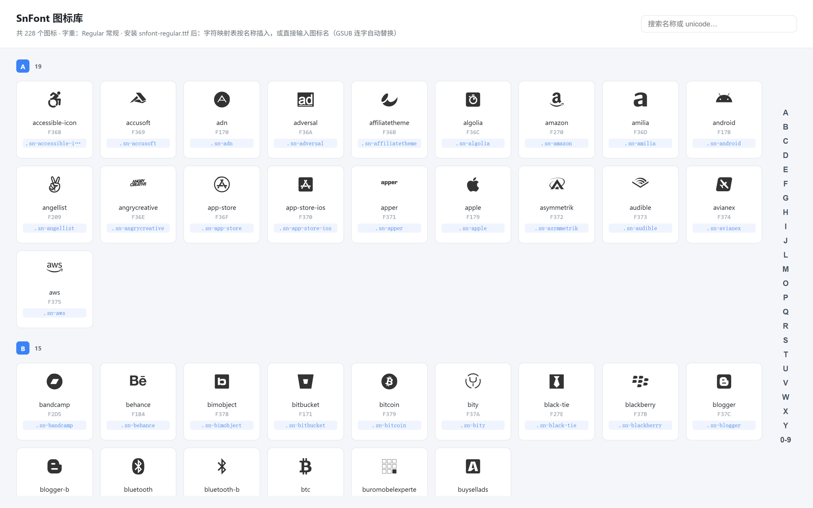

# SnFont 字体图标管理

**简体中文** | [English](./README.en.md)

[](https://github.com/mmingji/sn-font-manager/stargazers)
[](https://github.com/mmingji/sn-font-manager/releases)
[](https://github.com/mmingji/sn-font-manager/releases)
[](./LICENSE)
[](https://vuejs.org)
[](https://vitejs.dev)
[](#浏览器要求)
[](#开发方式ai-研发说明)
[](#贡献)

一个纯前端（零后端）的字体图标管理应用：上传字体文件解析为统一尺寸的 SVG，管理图标项目（增删改查、按首字母分组、批量操作），一键生成 `snfont-regular` / `snfont-bold` 两套产物（ttf / woff / woff2）及配套 CSS。字体支持 **GSUB 连字**——安装后在文本里直接输入图标名（如 `trash`）即自动替换为对应图标；也可在字符映射表按字形名搜索插入。

**绿色免安装版**：构建产物是**单个 index.html**，解压双击即用（无需安装、无需服务、不联网）。下载见 [Releases](https://github.com/mmingji/sn-font-manager/releases)。

## 界面预览

| 图标管理 | 解析字体 | 预览产物 |
| --- | --- | --- |
|  |  |  |

## 功能

| 功能 | 说明 |
| --- | --- |
| 字体解析 | 上传 ttf/otf/woff/woff2 解析为统一尺寸 SVG（128/512/1024 可自定义）。虚线框上半为解析前设置（SVG 尺寸/名称映射表/保持原 unicode），下半浅灰文件区（已解析信息+点击重选）。预览可勾选/改名/下载 zip；内置 unicode→名称映射表 `public/unicode-map.data.js` 自动命名，无名字字形按 uniXXXX 兜底 |
| 码位冲突处理 | 解析预览检测字形原码位与内置 ASCII 基础字形(0x20-0x7E)或项目已有图标码位冲突：卡片标红 + 三选一处理（自动分配/移除冲突/覆盖旧图标）。有冲突必须三选一才能导入 |
| 图标管理 | 主页面按名称首字母分组（中文按拼音），侧边字母索引、搜索、改名/替换/删除，卡片显示 unicode 码位，实时持久化 |
| 项目设置 | 右侧抽屉：项目名/CSS 前缀/字体名/字重/SVG 尺寸 + 「按 unicode 映射批量改名」 + 「本项目保留区占用」统计（已用/剩余 + 进度条，范围读 codepoint-plan.data.js） |
| 项目下载 | 完整 zip：ttf/woff/woff2 + css + demo.html + `<项目名>.project.json`，按产物字体名建文件夹 |
| 导入 | 批量 SVG（预览改名/勾选）、导入项目 json 恢复 |
| 顶部交互 | 搜索｜多选｜设置｜导入▾｜导出▾ |
| 字体能力 | GSUB 连字输入图标名即替换；post 表字形名可按名搜索；稳定码位删除不释放；内置拉丁字形取自真实字体(ASCII 94 字符)且可被覆盖；字重可选 |
| 码位规划 | 新增图标从 U+EE00–U+EFFF 保留区(512 个)顺序分配，避开参考字体已占区；allocateCode 双向跳过已占用 |
| 数据持久化 | IndexedDB 主存储 + localStorage 快照：数千图标不丢；写队列串行 + 刷新前同步兜底；启动 boot gate 避免大数据先空白 |
| 启动自检 | 按需检测异常 SVG 坐标（越界→裁入 0~1000）；仅确有异常才提示修复进度，正常数据完全静默（幂等） |
| 离线运行 | 绿色版：双击 dist/index.html 即用（零服务零联网）；如需 HTTP 部署仍可用任意静态托管 |
| 图片转 SVG | 拖入/多选位图 → potrace(WASM) 矢量化（阈值/反色/去噪点实时调参自动重转）→ 按项目 SVG 尺寸大预览 + 网格（改名/勾选/单张下载/下载全部）→ 导入；图标卡「替换」走同一弹窗（预览后替换，支持 svg 文件） |
| 绿色免安装版 | 构建产物为**单个 index.html**（JS/CSS/wasm/映射表全部内联）：解压后双击即用；`npm run pack` 一键打包成 SnFont-便携版.zip |

## 技术栈

- Vue 3 + Vite 6 + Pinia（纯前端；数据存 IndexedDB + localStorage 快照）
- **fontkit**：字体解析内核（vendored 单文件，见 `src/lib/fontkit-bundle.mjs`）；woff2 解码用 fonteditor-core 的 WASM
- fonteditor-core：TrueType 构建、ttf→woff/woff2 转换
- 自研 GSUB 生成器：连字表(lookup type 4)手写二进制注入
- JSZip + file-saver：zip 打包下载
- esm-potrace-wasm：位图矢量化（图片转 SVG）。**GPL-2.0** 许可说明：本地/内网自用无分发义务；输出的图标/字体是数据不受传染；若未来闭源商用分发整个应用，需更换为宽松许可库（改动面仅在 src/lib/traceImage.js 内部）
- vite-plugin-singlefile：构建单文件 HTML（把 JS/CSS 内联进 index.html，使 file:// 双击可用）

## 快速开始

要求：Node.js ≥ 18

```bash
npm install
npm run dev        # 开发：http://localhost:5173
npm run build      # 构建到 dist/
npm run pack       # 构建并打包绿色版 zip
```

### 本地运行（离线、双击）

**绿色免安装版**：`npm run pack` → 生成 `SnFont-便携版.zip`（约 0.94MB），解压后**双击 `SnFont/index.html` 即用**——
无需安装、无需启动服务、不联网（构建产物是单个 HTML，JS/CSS/woff2.wasm/映射表全部内联；file:// 下
`type="module"` 与 fetch 外部文件都会被 CORS 拦截，故用 IIFE + dataURL 内联，见 vite.config.js 注释）。

<a id="浏览器要求"></a>
**浏览器要求**：推荐 Chrome / Edge 90+（Firefox 对 file:// 的数据存储限制较严；Safari 未测试）。
**本软件本身不含任何项目数据**，数据存在浏览器本地（IndexedDB）：

- 浏览器对 file:// 页面**不按文件夹区分存储**：移动/复制本文件夹不会丢数据；同一浏览器里任意位置的本地页面看到的是同一份数据（因此不能用"多解压几份"隔离不同项目）；
- 换机器或清理浏览器数据前，用「导出 ▾ → 下载项目」保存备份，新环境「导入 ▾ → 导入 SVG」恢复；
- 清空数据：在应用里删除图标，或清除该浏览器的站点数据。

（开发预览也可 `npm run preview` 起本地静态服务；HTTP 部署直接用 dist/ 即可。）

## 部署

`dist/` 纯静态，可部署到任意静态托管（Nginx / GitHub Pages / Vercel / Netlify / 内网）。无后端、零环境依赖。

## 使用流程

1. **导入图标**：顶部「导入▾」→「导入 SVG」批量导入；「图片转 SVG」把位图矢量化（阈值/反色可调、支持多图）；「解析字体」上传 ttf/otf/woff/woff2 拆解字形 → 三种入口均进入预览（改名/勾选/冲突处理）→ 导入或下载
2. **管理图标**：主页面分组展示；「多选」批量删除/导出；「设置」抽屉改配置
3. **下载项目**：「导出▾」→「下载项目」，得 `<字体名>-project.zip`
4. **使用字体**：Web 引 css 用 `<i class="sn-trash">`；桌面装 ttf 输入图标名即替换（GSUB）；demo.html 可复制进 PS

## 项目结构

```
src/
├─ lib/
│  ├─ parseFont.js      # 字体 → SVG 解析（fontkit 内核 + woff2 WASM 解码）
│  ├─ buildFont.js      # TrueType 构建 + y 翻转 + css 生成
│  ├─ gsub.js           # GSUB 连字表生成与注入
│  ├─ baseGlyphs.js     # 内置基础拉丁字形（双字重，连字触发）
│  ├─ svgNormalize.js   # SVG 规范化与越界修复（幂等；clampSvgToBox / normalizeSvgForce）
│  ├─ traceImage.js     # 位图 → SVG 矢量化（canvas 二值化 + potrace WASM 封装）
│  ├─ unicodeMap.js     # unicode→名称 映射表读取与应用
│  ├─ codepointPlan.js  # 码位规划配置读取（保留区 / 参考分段）与判定
│  ├─ loadDataScript.js # 动态加载可编辑数据文件（*.data.js，带时间戳绕缓存）
│  ├─ pinyin.js         # 中文拼音分组/排序
│  ├─ zip.js            # zip 打包（SVG/项目包/demo.html）
│  └─ persist.js        # IndexedDB + localStorage 持久化
├─ store/project.js     # Pinia：CRUD/分组/稳定码位/冲突覆盖/启动引导
└─ components/          # 页面组件（FontParser/ImportModal/SettingsModal 抽屉…）
```

## 说明

- 数据存 IndexedDB（大容量）+ localStorage 快照；导出 `<项目名>.project.json` 可备份迁移
- 图标码位永久固定；新增从 U+EE00+ 保留区分配，与参考字体不冲突
- 字重只影响产物文件名与字母/符号字形；图标名/unicode/css 类名与字重无关
- 生成字体过程不出现任何第三方图标库名称
- **内置名称映射文件**（public/unicode-map.data.js）中的图标命名来自 Font Awesome v7.3.1 的命名；该文件仅为「码位 → 名称」的命名参考数据（不含其字体、图标资源或代码），可自行编辑维护
- 数据文件统一为经典脚本形态（开发/构建/绿色版一致，内容即 JSON，编辑后刷新即生效）：public/unicode-map.data.js（图标名称映射表）、public/codepoint-plan.data.js（码位规划配置：顶部 project_alloc 决定本项目保留区，reference_sections 记录参考图标集的占用分段定义）
  - 运行时动态加载并带时间戳，规避浏览器脚本缓存；文件名可在「解析字体 → 名称映射表」与「设置 → 本项目保留区占用」中点击打开
  - 文件缺失时自动回退到构建时内联的快照（保证"仅有 index.html 也能正常使用"）
- **GSUB 连字（输入图标名自动替换）实现要点**：连字按「组件数降序」排列——否则短名会抢走长名（如输入 `apple-pay` 只替换出「苹果图标 + -pay」）；连字数据超过 u16 偏移上限（约 64KB）时自动分片为多个 **Extension 子表**（Lookup Type 7，u32 偏移），保证上千个图标时连字仍全部可触发。**已知边界**：同一首字符下名字极多（上千条同前缀）时属极端场景，建议图标名首字符保持分散
- **解析字体时会自动跳过 glyph 0（`.notdef`）与 Unicode 非字符码位**（U+FDD0–U+FDEF / U+*FFFE / U+*FFFF）的字形：它们不是图标，且非字符码位（源字体常把 `.notdef` 映射到 U+FFFF）会让字体构建在解析该码位时中断，曾导致"导出的字体只剩基础字形"。构建字体时也会对旧项目数据做同样过滤（控制台会提示跳过了几个），导入时若码位为非字符会自动改为分配；生成的字体里 glyph 0 由 fonteditor-core 自动创建，无需也不应由源字体提供
- 字体解析内核为 fontkit（vendored 单文件，附生成命令）：取代 opentype.js——后者解析 CFF/OTF 紧凑曲线编码会把空心环/细线类图标的轮廓放大并破坏挖孔方向（曾致空心圆渲染成粗实心环）；现产物带 fill-rule=evenodd（几何挖孔，不依赖路径方向）
- 图片转 SVG 适用边界：白底/透明底纯色、线稿类图标效果最佳（阈值/反色/去噪点可调）；照片、渐变、复杂细节不适合矢量化，且结果恒为单色轮廓（字体图标的天然约束）
- 图片转 SVG 预览按项目设置的 SVG 尺寸渲染（与设置抽屉「SVG 尺寸」三处统一）；预览结果可逐张下载 SVG，供 Illustrator 等矢量工具精修后再导入
- 图片转 SVG 的阈值/反色/去噪点参数按单张图独立保存：下方点选哪张，上面就预览并调整哪张；预览焦点卡片为加粗外描边，与勾选（蓝底）区分

## 开发方式（AI 研发说明）

<a id="开发方式ai-研发说明"></a>
本项目是 **AI 辅助编程产物**：需求定义、方案决策、验收与迭代由项目作者（sn476）完成，代码实现与重构由 AI 编码代理生成。

- 研发工具：DeepSeek Harness（终端内的 AI 编码代理）
- 使用模型：`deepseek-v4-flash-vision-exp`（DeepSeek）
- 协作方式：作者提出需求与验收标准 → AI 实现并自测（浏览器端 E2E、截图比对、字体产物校验）→ 作者复核反馈 → 迭代
- 提示：AI 生成的代码请在采用前自行评估与测试；本项目按「现状」提供，不提供任何担保（见 LICENSE）

## 许可证

- **本项目代码**：MIT，Copyright (c) 2026 sn476（见 [LICENSE](./LICENSE)）
- **第三方组件**：清单见 [THIRD-PARTY-NOTICES.md](./THIRD-PARTY-NOTICES.md)。其中 `esm-potrace-wasm`（图片转 SVG 的矢量化引擎）为 **GPL-2.0**，且会被内联进构建产物（dist/）：**自己使用/内部使用不受影响**；**对外分发产物时需遵守 GPL-2.0**（随附许可证文本并提供对应源码的获取方式）
- **内置名称映射数据**：`public/unicode-map.data.js` 中的图标命名来自 **Font Awesome v7.3.1 的命名**（仅为「码位 → 名称」的命名参考数据，不含其字体、图标资源或代码）

<a id="贡献"></a>
## 贡献

欢迎 Issue / PR：报告问题请附「浏览器版本 + 复现步骤 + 截图」；涉及图标尺寸/形状的问题，建议附上原始字体文件与码位。
